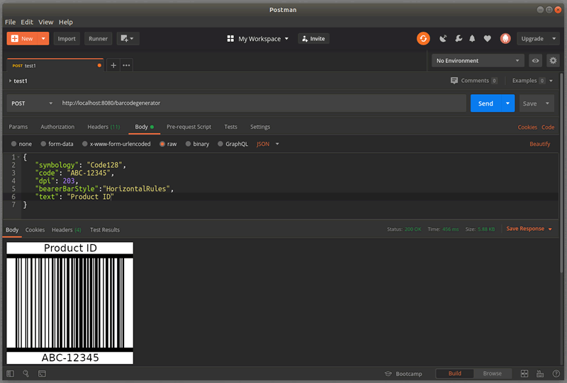

# BarcodePro Web API for Docker

**[BarcodePro Web API for Docker](https://www.neodynamic.com/products/barcode/docker/)** generates **High-Quality GS1-ISO-Compliance barcode images** that can be used from **Any Development Platform and Programming Languages (.NET, Java, PHP, Javascript, Python, Ruby, and more!)** 

Designed by following some of the **REST** principles, **BarcodePro Web API for Docker** responds to a simple **[HTTP POST](https://neodynamic.com/products/barcode/docker#How-to-use)** by specifying the **[Barcode settings through a JSON object](https://neodynamic.com/products/barcode/docker#The-Barcode-Object)** in the request body, returning the output rendering in the image or document format specified through the **[Accept](https://neodynamic.com/products/barcode/docker#The-Accept-Header)** header.

### 👍 Linear (1D), Postal, Stacked & 2D Barcodes

**[BarcodePro Web API for Docker](https://www.neodynamic.com/products/barcode/docker/)** supports most popular [**Linear (1D), Postal, Component Composite & 2D Barcode Symbologies**](https://neodynamic.com/barcodes) all-in-one solution including Code 39, Code 128, GS1-128, GS1 DataBar (RSS-14), EAN 13 & UPC, Postal (USPS, British Royal Mail, Australia Post, DHL, FedEx, Japan), Data Matrix (DMRE), QR Code, PDF 417, Aztec Code, UPS MaxiCode, Chinese Han Xin Code, IFA PPN, all EAN/UPC Composite Barcodes (CC-A, CC-B & CC-C), Mailmark, DotCode, Swiss-QRCode, JAB-Code Multicolored 2D Matrix and [many more barcode standards](https://neodynamic.com/barcodes)

### 👍 GS1-AIM-ISO/IEC Compliance
Our barcode algorithms were written by following the official specifications of each barcode symbology. Our barcode engine provides you with exclusive features like auto-checksum, data validation, Bar Width Adjustment (BWA) for linear & 2D symbols, auto-encoding methods for shortest barcode symbol generation.

### 👍 Best-in-class Imaging Support

**[BarcodePro Web API for Docker](https://www.neodynamic.com/products/barcode/docker/)** creates barcodes in **raster formats like PNG, JPEG/JPG, PCX & PDF as well as in SVG & EPS vector formats!** All barcode can be **rotated at 90, 180 & 270** degrees. **Rounded Border & Beader Bars** are also supported. **High Quality DPI Resolution** is supported for **PNG & JPEG** outputs.

**[BarcodePro Web API for Docker](https://www.neodynamic.com/products/barcode/docker/)** also supports **Artistic Barcodes** i.e. customized barcodes by stamping logos or pictures on symbols as well as specifying an image for filling the bars or dots!

## 📖 Help Doc

[Sample code for most popular programming languages and help topics](https://neodynamic.com/products/barcode/docker/#Overview)

### Supported CodePages/Encodings

This is the list of supported CodePages and Encodings for **[Barcode's codeBase64EncodingName](https://neodynamic.com/products/barcode/docker/#The-ZPLPrintJob-Object)** property/attribute.

|CodePage|Identifier/Name|
|--------|---------------|
|37     |IBM037                  |      
|437    |IBM437                  |      
|500    |IBM500                  |      
|708    |ASMO-708                |      
|720    |DOS-720                 |      
|737    |ibm737                  |      
|775    |ibm775                  |      
|850    |ibm850                  |      
|852    |ibm852                  |      
|855    |IBM855                  |      
|857    |ibm857                  |      
|858    |IBM00858                |      
|860    |IBM860                  |      
|861    |ibm861                  |      
|862    |DOS-862                 |      
|863    |IBM863                  |      
|864    |IBM864                  |      
|865    |IBM865                  |      
|866    |cp866                   |      
|869    |ibm869                  |      
|870    |IBM870                  |      
|874    |windows-874             |      
|875    |cp875                   |      
|932    |shift_jis               |      
|936    |gb2312                  |      
|949    |ks_c_5601-1987          |      
|950    |big5                    |      
|1026   |IBM1026                 |      
|1047   |IBM01047                |      
|1140   |IBM01140                |      
|1141   |IBM01141                |      
|1142   |IBM01142                |      
|1143   |IBM01143                |      
|1144   |IBM01144                |      
|1145   |IBM01145                |      
|1146   |IBM01146                |      
|1147   |IBM01147                |      
|1148   |IBM01148                |      
|1149   |IBM01149                |      
|1200   |utf-16                  |      
|1201   |unicodeFFFE             |      
|1250   |windows-1250            |      
|1251   |windows-1251            |      
|1252   |Windows-1252            |      
|1253   |windows-1253            |      
|1254   |windows-1254            |      
|1255   |windows-1255            |      
|1256   |windows-1256            |      
|1257   |windows-1257            |      
|1258   |windows-1258            |      
|1361   |Johab                   |      
|10000  |macintosh               |      
|10001  |x-mac-japanese          |      
|10002  |x-mac-chinesetrad       |      
|10003  |x-mac-korean            |      
|10004  |x-mac-arabic            |      
|10005  |x-mac-hebrew            |      
|10006  |x-mac-greek             |      
|10007  |x-mac-cyrillic          |      
|10008  |x-mac-chinesesimp       |      
|10010  |x-mac-romanian          |      
|10017  |x-mac-ukrainian         |      
|10021  |x-mac-thai              |      
|10029  |x-mac-ce                |      
|10079  |x-mac-icelandic         |      
|10081  |x-mac-turkish           |      
|10082  |x-mac-croatian          |      
|12000  |utf-32                  |      
|12001  |utf-32BE                |      
|20000  |x-Chinese-CNS           |      
|20001  |x-cp20001               |      
|20002  |x-Chinese-Eten          |      
|20003  |x-cp20003               |      
|20004  |x-cp20004               |      
|20005  |x-cp20005               |      
|20105  |x-IA5                   |      
|20106  |x-IA5-German            |      
|20107  |x-IA5-Swedish           |      
|20108  |x-IA5-Norwegian         |      
|20127  |us-ascii                |      
|20261  |x-cp20261               |      
|20269  |x-cp20269               |      
|20273  |IBM273                  |      
|20277  |IBM277                  |      
|20278  |IBM278                  |      
|20280  |IBM280                  |      
|20284  |IBM284                  |      
|20285  |IBM285                  |      
|20290  |IBM290                  |      
|20297  |IBM297                  |      
|20420  |IBM420                  |      
|20423  |IBM423                  |      
|20424  |IBM424                  |      
|20833  |x-EBCDIC-KoreanExtended |      
|20838  |IBM-Thai                |      
|20866  |koi8-r                  |      
|20871  |IBM871                  |      
|20880  |IBM880                  |      
|20905  |IBM905                  |      
|20924  |IBM00924                |      
|20932  |EUC-JP                  |      
|20936  |x-cp20936               |      
|20949  |x-cp20949               |      
|21025  |cp1025                  |      
|21866  |koi8-u                  |      
|28591  |iso-8859-1              |      
|28592  |iso-8859-2              |      
|28593  |iso-8859-3              |      
|28594  |iso-8859-4              |      
|28595  |iso-8859-5              |      
|28596  |iso-8859-6              |      
|28597  |iso-8859-7              |      
|28598  |iso-8859-8              |      
|28599  |iso-8859-9              |      
|28603  |iso-8859-13             |      
|28605  |iso-8859-15             |      
|29001  |x-Europa                |      
|38598  |iso-8859-8-i            |      
|50220  |iso-2022-jp             |      
|50221  |csISO2022JP             |      
|50222  |iso-2022-jp             |      
|50225  |iso-2022-kr             |      
|50227  |x-cp50227               |      
|51932  |euc-jp                  |      
|51936  |EUC-CN                  |      
|51949  |euc-kr                  |      
|52936  |hz-gb-2312              |      
|54936  |GB18030                 |      
|57002  |x-iscii-de              |      
|57003  |x-iscii-be              |      
|57004  |x-iscii-ta              |      
|57005  |x-iscii-te              |      
|57006  |x-iscii-as              |      
|57007  |x-iscii-or              |      
|57008  |x-iscii-ka              |      
|57009  |x-iscii-ma              |      
|57010  |x-iscii-gu              |      
|57011  |x-iscii-pa              |      
|65000  |utf-7                   |      
|65001  |utf-8                   |  

## Licensing

**BarcodePro Web API for Docker is a Commercial** product. Licensing model and prices are available [here](https://neodynamic.com/products/barcode/docker/buy)

## Support

Tech questions are handled by [Neodynamic Dev Team](https://neodynamic/support)
